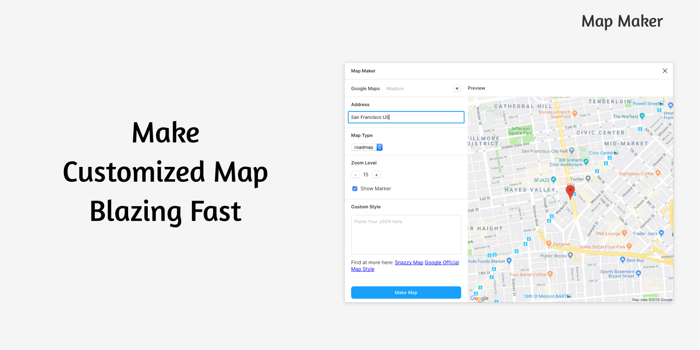
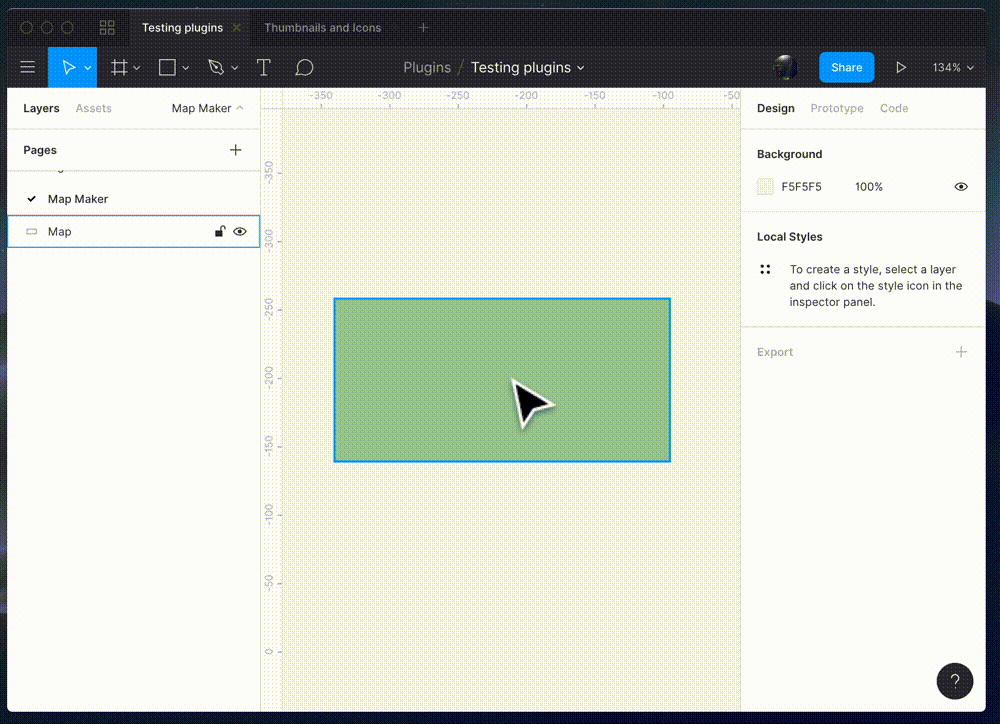

# Map Maker

Map Maker allows you to make a customized map blazing fast.

[](LICENSE)



## Usage


#### 1. Easy To Use

Select any layer including Rectangle, Ellipse or even Polygon, and run Map Maker.

#### 2. Fully Customizable

Google Maps :
1. Address
2. Map Types (including roadmap, satellite, hybrid, and terrain)
3. Zoom Level
4. Showing Marker
5. Custom JSON using Google Maps API's Styling Wizard or Snazzy Maps

Mapbox :
1. Address
2. Style
3. Zoom Level
4. Bearing
5. Pitch


#### 3. Editable

Select your Map and run Map Maker again.
It saves all your customization to your layer.

#### 4. Live Preview

You can hide the build-in preview, and see the actual output live on your canvas, while editing your map.

---

Google Map


## Installation
https://www.figma.com/c/plugin/731312569747199418/Map-Maker

## Contributing

Pull requests are welcome. For major changes, please open an issue first to discuss what you would like to change.

#### Development

```bash
yarn watch
```

## Licence
MIT